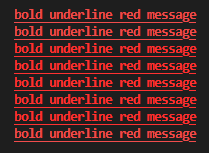
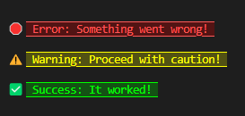

**style-escape-codes** • [**Docs**](modules.md)

***

# Style Escape Codes (sec)

Yet another ansi escape code sequence styler (#insert-mouthful-emoji-here).
Supports stacking, nested and global styles; rgb, hex and hsl color
spaces out of the box, no dependencies. Keep in mind that each terminal has
slightly different color translation for the predefined color values like
`fgRed`. Bundle includes both ESM and CJS files.

## Installation

### Install the package

```sh
npm install style-escape-codes
# or
yarn add style-escape-codes
```

### Load as module

```javascript
import { sec } from 'style-escape-codes';
// or
import { sec } from 'style-escape-codes/esm/';
```

### Load as commonjs

```javascript
const sec = require('style-escape-codes').sec;
// or
const sec = require('style-escape-codes/cjs/').sec;
// or
const { sec } = require('style-escape-codes');
// or
const { sec } = require('style-escape-codes/cjs/');
```

## API

### Usage:

sec. `<style|set-color>[.<style|set-color>...][(<message>)|.set()|.unset()|.toString()]`

**examples:**

- `sec.b.fg.rgb(255,0,0)('red bold message');`
- `sec.b.fgRed.set();`
- `sec.b.fgRed.unset();`
- `sec.b;`

#### `<style>` parameter:

- **reset** - reset all styles to their defaults.
- **bold** - text appears with increased intensity.
- **dim** - text appears with decreased intensity.
- **italic** - text slants slightly to the right, and guess what it was first
  used in Italy.
- **underline** - line under the text.
- **invert** - swap foreground and background colors.
- **hide** - text becomes invisible.
- **strike** - text is crossed-out.
- **underlineDouble** - double underline.
- **overline** - like underline, but completely opposite.
- **foregroundColor** - set foreground color sequence. Use _.rgb()_, _.hex()_ or _.hsl()_ methods next.
- **fgBlack** - set foreground color to Black.
- **fgRed** - set foreground color to Red.
- **fgGreen** - set foreground color to Green.
- **fgYellow** - set foreground color to Yellow.
- **fgBlue** - set foreground color to Blue.
- **fgMagenta** - set foreground color to Magenta.
- **fgCyan** - set foreground color to Cyan.
- **fgWhite** - set foreground color to White.
- **fgBrightBlack** - set foreground color to Bright Black.
- **fgBrightRed** - set foreground color to Bright Red.
- **fgBrightGreen** - set foreground color to Bright Green.
- **fgBrightYellow** - set foreground color to Bright Yellow.
- **fgBrightBlue** - set foreground color to Bright Blue.
- **fgBrightMagenta** - set foreground color to Bright Magenta.
- **fgBrightCyan** - set foreground color to Bright Cyan.
- **fgBrightWhite** - set foreground color to Bright White.
- **backgroundColor** - set background color sequence. Use _.rgb()_, _.hex()_ or _.hsl()_ methods next.
- **bgBlack** - set background color to Black.
- **bgRed** - set background color to Red.
- **bgGreen** - set background color to Green.
- **bgYellow** - set background color to Yellow.
- **bgBlue** - set background color to Blue.
- **bgMagenta** - set background color to Magenta.
- **bgCyan** - set background color to Cyan.
- **bgWhite** - set background color to White.
- **bgBrightBlack** - set background color to BrightBlack.
- **bgBrightRed** - set background color to BrightRed.
- **bgBrightGreen** - set background color to BrightGreen.
- **bgBrightYellow** - set background color to BrightYellow.
- **bgBrightBlue** - set background color to BrightBlue.
- **bgBrightMagenta** - set background color to BrightMagenta.
- **bgBrightCyan** - set background color to BrightCyan.
- **bgBrightWhite** - set background color to BrightWhite.

_shorts:_

- **r** _(reset)_
- **b** _(bold)_
- **d** _(dim)_
- **i** _(italic)_
- **u** _(underline)_
- **inv** _(invert)_
- **h** _(hide)_
- **s** _(strike)_
- **ud** _(underlineDouble)_
- **o** _(overline)_
- **fg** _(foregroundColor)_
- **bg** _(backgroundColor)_
- **black** _(fgBlack)_
- **red** _(fgRed)_
- **green** _(fgGreen)_
- **yellow** _(fgYellow)_
- **blue** _(fgBlue)_
- **magenta** _(fgMagenta)_
- **cyan** _(fgCyan)_
- **white** _(fgWhite)_
- **brightBlack** _(fgBrightBlack)_
- **brightRed** _(fgBrightRed)_
- **brightGreen** _(fgBrightGreen)_
- **brightYellow** _(fgBrightYellow)_
- **brightBlue** _(fgBrightBlue)_
- **brightMagenta** _(fgBrightMagenta)_
- **brightCyan** _(fgBrightCyan)_
- **brightWhite** _(fgBrightWhite)_

#### `set-color` parameter:

`.{fg|foregroundColor|bg|backgroundColor}.{rgb(<r>,<g>,<b>)|hex(<hexvalue>)|hsl(<h>,<s>,<l>)}`

**examples**:

- `sec.fg.hsl(0, 100, 50);`
- `sec.bg.hex('f00');`
- `sec.backgroundColor.rgb(255, 0, 0);`

**parameters:**

- **r, g, b** - number [0, 255]
- **hexvalue** - number [0, 16777215] or string of length 6, 3 or 1 characters
- **h** - number [0, 360)
- **s, l** - number [0, 100]

## Examples

### Difference between call, set, unset and toString

Calling the last property of the sec object as function is the same as
surrounding a text with .set() and .unset() methods. .toString() internally
calls .set() and implicit coercion to string calls .toString().

```js
console.log(sec.b('bold message'));
console.log(sec.b.set() + 'bold message' + sec.b.unset());
console.log(sec.b.toString() + 'bold message' + sec.b.unset());
console.log(sec.b + 'bold message' + sec.b.unset());
```

### Stacked styles

You can chain styles by calling them as a property of the previous style.

```js
console.log(sec.u.i.b.red('underline, italic, bold red message'));
```

### Nested styles

You can set styles inside styles.

```js
console.log(
  sec.u.i.b.red(
    `underline, italic, bold red ${sec.blue('with blue inside')} message`
  )
);
```

### Same-same, but different

All of the examples below do the same thing.

```js
console.log(sec.bold.underline.red('bold underline red message'));
console.log(sec.b.u.fgRed('bold underline red message'));
console.log(sec.b.u.fg.rgb(255, 0, 0)('bold underline red message'));
console.log(sec.b.u.fg.hex('ff0000')('bold underline red message'));
console.log(sec.b.u.fg.hex('f00')('bold underline red message'));
console.log(sec.b.u.fg.hex(0xff0000)('bold underline red message'));
console.log(sec.b.u.fg.hsl(0, 100, 50)('bold underline red message'));
console.log(sec.b.u.fgRed + 'bold underline red message' + sec.b.u.fg.unset());
```



### Real world examples

Simple real world example.

```js
console.log(
  '\n',
  `🛑 ${sec.u.o.fg.hex('f00').bg.hsl(0, 60, 20)(' Error: Something went wrong! ')}`,
  '\n\n',
  `⚠️  ${sec.u.o.fg.hex('ff0').bg.hsl(60, 60, 20)(' Warning: Proceed with caution! ')}`,
  '\n\n',
  `✅ ${sec.u.o.fg.hex('0f0').bg.hsl(120, 60, 20)(' Success: It worked! ')}`,
  '\n'
);
```



### Global styles (for terminals only)

You can leave the style 'open' by using .set() or .toString() methods and your
terminal will continue to use that style until there is a different escape code
sequence or a 'reset' code was used.

```js
console.log('This is a regular output');
// set global style by calling the .set() method or by using .toString()
console.log(sec.i.fg.hex('9').bg.hex('3') + '');
// using exec for the sake of the example
exec(
  `echo This is an output from a different command, but it's styled as you can see. && \
  echo And this is another row. && \
  echo This is the third output from an echo command. `,
  (err, stdout) => {
    console.log(stdout);
    // don't forget to .unset() your global styles, or they will overflow
    // .b.fgRed will actually unset b and fg styles after the message
    console.log(sec.b.fgRed('Oops we have serious leak under the sink!'));
    console.log('Is it red or bold? Nope.');
    console.log(sec.i.fg.bg.unset());
    console.log('All ok now.');
  }
);
```


## License

This project is licensed under the MIT License.
